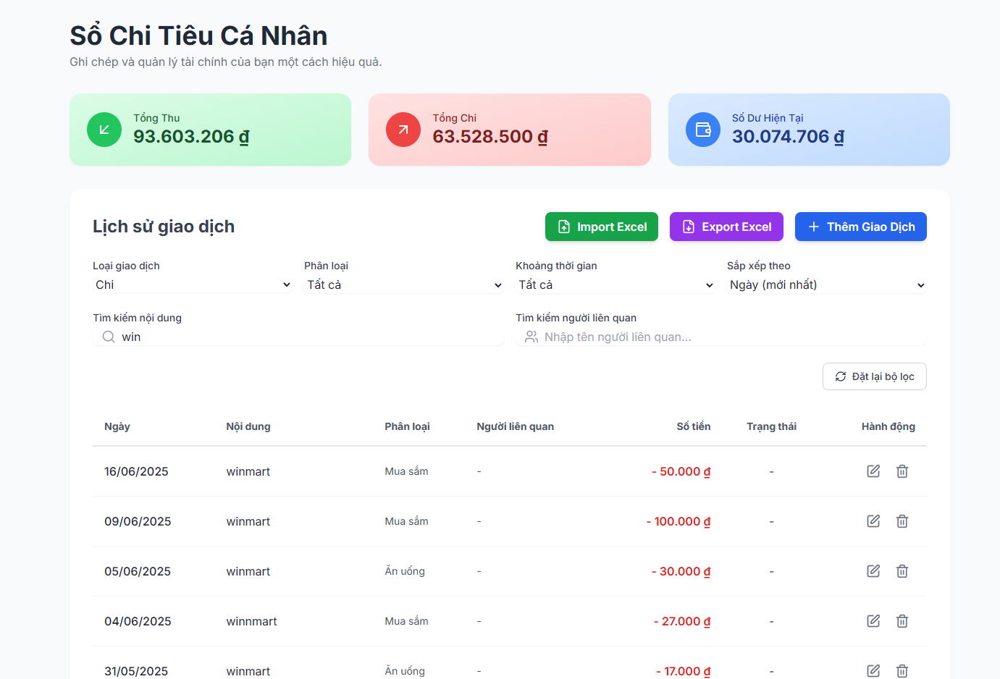

# Supabase Setup Guide

## Step 1: Supabase Configuration

1. Visit [Supabase Dashboard](https://supabase.com/dashboard/projects) and create a new project
2. Go to "Project Settings" (Gear icon) -> "API"
3. Copy your "Project URL" and "anon" public key to replace the following variables:

```javascript
const supabaseUrl = "YOUR_PROJECT_URL"; // Replace with your project URL
const supabaseKey = "YOUR_ANON_KEY"; // Replace with your anon key
```

## Step 2: Database Setup

1. In your Supabase project, navigate to "SQL Editor"
2. Click "New query" and paste the following SQL code
3. Click "RUN" to create the `transactions` table

```sql
create table public.transactions (
  id uuid not null default gen_random_uuid (),
  created_at timestamp with time zone not null default timezone ('utc'::text, now()),
  date date not null,
  description text not null,
  amount numeric not null,
  category text not null,
  type text not null,
  related_person text null,
  is_paid smallint null default '0'::smallint,
  user_id uuid null,
  constraint transactions_pkey primary key (id)
) TABLESPACE pg_default;

-- Enable Row Level Security (RLS)
ALTER TABLE transactions ENABLE ROW LEVEL SECURITY;

-- Create policy to allow public users to manage transactions
-- NOTE: This is a demo configuration. In a production environment,
-- you should implement stricter security rules based on user authentication
CREATE POLICY "Public users can manage transactions" ON transactions
FOR ALL
USING (true)
WITH CHECK (true);
```

## Security Note

The current configuration allows public access to the transactions table for demonstration purposes. In a production environment, you should implement proper authentication and more restrictive security policies.
